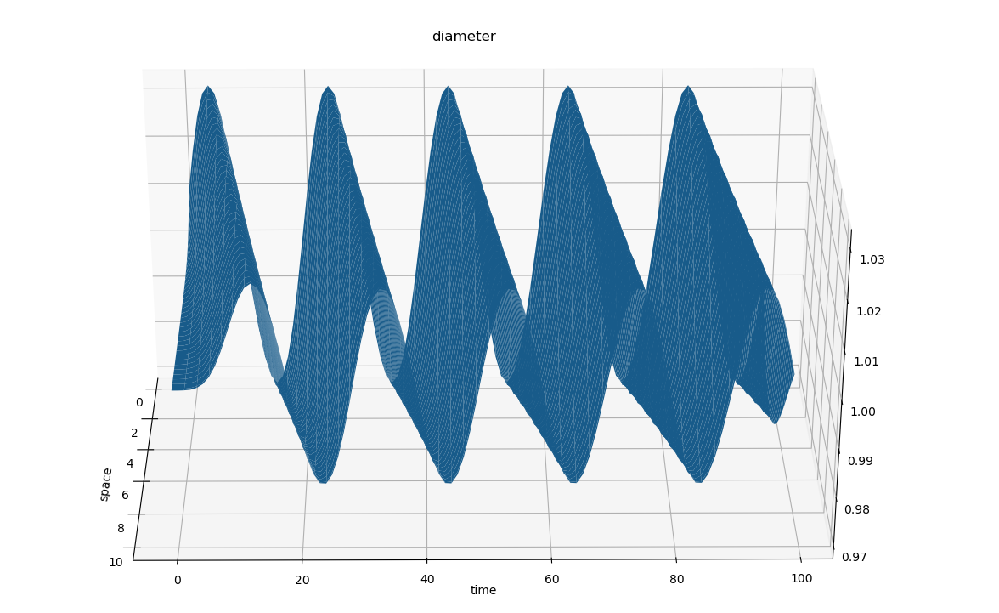

## Setup

ALTERNATIVE TO THE LINK:

We want to simulate the internal flow in a flexible tube as shown in the figure below (image from [1]).


The flow is assumed to be incompressible flow and gravity is neglected. Due to the axisymmetry, the flow can be described using a quasi-two-dimensional continuity and momentum equations. The motivation and exact formulation of the equations that we consider can be found in [2]. 

The following parameters have been chosen:
- Length of the tube: L = 10
- Inlet velocity: $$ v_{inlet} = 10 + 3 sin (10 \pi t) $$
- Initial cross sectional area = 1
- Initial velocity: v = 10
- Initial pressure: p = 0
- Fluid density: $$ \rho = 1 $$
- Young modulus: E = 10000


## Available solvers

Both fluid and solid participant are supported in:

* *C++*: An example solver using the intrinsic [C++ API of preCICE](couple-your-code-api.html)
* *Python*: An example solver using the preCICE [Python bindings](installation-bindings-python.html). This solver also depends on the Python libraries `numpy scipy matplotlib vtk tkinter mpi4py`.


### Building the C++ Solver

In order to use the C++ solver, you first need to build the scripts `FluidSolver` and `SolidSolver`. Each script needs to be built separately.

```
cd fluid-cpp
mkdir build && cd build
cmake ..
make all
```

```
cd solid-cpp
mkdir build && cd build
cmake .. 
make all
```

Building can be skipped if you do not plan to use the C++ version.  

## Running the Simulation 

### C++

Open two separate terminals and start each participant by calling the respective run script. 

```
cd fluid-cpp
./run.sh
# or, in parallel: ./run.sh -parallel
```
and
```
cd solid-cpp
./run.sh
```

The run scripts set the input parameters `N = 100`, `tau = 0.01`, `kappa = 100`. 



### Python

Open two separate terminals and start each participant by calling the respective run script. Only serial run is possible:

```
cd fluid-python
./run.sh
```
and
```
cd solid-python
./run.sh
```
Parameters such as `N` can be modified directly at the `FluidSolver.py` and at the `SolidSolver.py`. The parameters must be consistent between the different solvers and participants. 

**Optional:** Visualization and video output of the fluid participant can be triggered via the options `--enable-plot` and `--write-video` of `FluidSolver.py`. To generate .vtk files during execution, you need to add the flag `--write-vtk`.



## Post-processing

The `postproc/` folder contains the .vtk files resulting from the execution, which you can visualize using eg. paraview. Alternatively you can visualize the results with the provided `postproc/plot-fluid.py` script:

```bash
$ python3 postproc/plot-fluid.py <quantity> postproc/<prefix>
```
Note the required arguments specifying which quantity to plot (`pressure`, `velocity` or `diameter`) and the name prefix of the target vtk files.

For example, to plot the diameter using the default prefix for vtk files, we execute:
```bash
$ python3 postproc/plot-fluid.py diameter postproc/out_fluid_
```


If you run the case in parallel, you can visualize the results calculated by one rank (eg. rank 0) as follows:

```bash
$ python3 postproc/plot-fluid.py diameter postproc/out_fluid0_
```


## References

[1] B. Gatzhammer. Efficient and Flexible Partitioned Simulation of Fluid-Structure Interactions. Technische Universitaet Muenchen, Fakultaet fuer Informatik, 2014.

[2] J. Degroote, P. Bruggeman, R. Haelterman, and J. Vierendeels. Stability of a coupling technique for partitioned solvers in FSI applications. Computers & Structures, 2008.

[3] M. Mehl, B. Uekermann, H. Bijl, D. Blom, B. Gatzhammer, and A. van Zuijlen.
Parallel coupling numerics for partitioned fluid-structure interaction simulations. CAMWA, 2016.  


